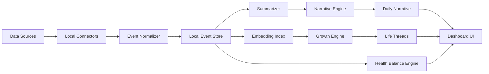

# Personal Growth OS — AI Diary / Life Narrative System

## 1. 产品整体架构

Personal Growth OS 不是生产力工具，而是一个“人生成长镜子”。它把浏览、聊天、任务、运动、睡眠和手动记录统一为 Life Events，再由 AI 将事件重新解释为成长叙事、人生主线与长期变化。

核心原则：

- 不批评，不制造 guilt，不用 KPI 评价人生。
- 以“看见积累”为第一目标，缓解“今天白过了”的虚无感。
- 本地优先，用户拥有全部数据。
- AI 像人生观察者，不像教练、老板或考核系统。

## 2. 系统模块图



## 3. 前后端技术选型

推荐生产版本：

- 前端：Next.js、React、Tailwind CSS、shadcn/ui、Framer Motion、Recharts / Visx。
- 后端：FastAPI 或 Node.js NestJS。
- 数据库：PostgreSQL + pgvector；本地版可用 SQLite + sqlite-vss / LanceDB。
- 缓存与任务队列：Redis + BullMQ / Celery。
- 本地 AI：Ollama / llama.cpp；embedding 用 bge-m3、nomic-embed-text 或 e5-large。
- 桌面封装：Tauri，便于本地文件、浏览器历史和健康数据导入。

当前原型：零依赖静态 HTML/CSS/JS，直接打开 `index.html` 可体验核心界面。

## 4. 数据流设计

1. Connector 读取 Chrome、Edge、ChatGPT 标题、豆包、DeepSeek、TickTick、小米健康与手动输入。
2. Normalizer 将所有数据转成统一 LifeEvent。
3. Classifier 提取主题、情绪、活动类型、重要度和成长信号。
4. Embedding Worker 在本地生成向量，写入向量索引。
5. Summarizer 每日聚合事件，生成事实层摘要。
6. Narrative Engine 将事实层转成温柔的人生叙事。
7. Growth Engine 周期性发现 Life Threads、趋势迁移与长期变化。
8. UI 只展示可解释、可追溯、可编辑的结果。

### 数据源接入方式

| 数据源 | 推荐 MVP 接入 | 是否需要用户配置 | 隐私策略 |
| --- | --- | --- | --- |
| Chrome 浏览记录 | 桌面端读取本机 `History` SQLite 副本 | 需要授权访问浏览器数据目录 | 默认只读标题、URL、时间；可隐藏敏感域名 |
| Edge 浏览记录 | 同 Chrome，读取 Edge 本机 History 副本 | 需要授权 | 默认只读标题、URL、时间 |
| ChatGPT 聊天标题 | 用户导出数据包，或浏览器插件读取会话列表标题 | 需要用户导出或登录态授权 | MVP 只读标题，不读正文 |
| 豆包 / DeepSeek 标题 | 浏览器插件或手动 CSV/JSON 导入 | 需要用户导出或插件授权 | 默认只读标题 |
| TickTick / 滴答清单 | 官方 API / ICS / CSV 导出 | 需要 token 或导出文件 | 只读任务标题、完成时间、标签 |
| 小米运动健康 | 健康数据导出 / 手机端桥接 / 手动导入 | 需要导出或移动端同步 | 只读日级聚合数据 |
| 手动输入 | App 内记录 | 不需要 | 用户可设为私密，不进入 AI |

浏览器读取的工程注意：

- Chrome / Edge 的 History 数据库通常在浏览器运行时被锁定，桌面端应复制一份临时副本再读取。
- 只把 `title`、`url host`、`last_visit_time`、`visit_count` 转为 LifeEvent；完整 URL query 默认脱敏。
- 提供排除规则：无痕不可读、金融/医疗/成人/工作域名可默认隐藏或本地红线过滤。

AI 聊天读取的工程注意：

- 最稳妥的 MVP 是“导出文件导入”与“手动粘贴标题列表”。
- 浏览器插件模式更自动，但需要维护不同网站 DOM 变化。
- 除非用户明确开启“读正文”，否则只分析标题与时间，避免把私人对话全文送进模型。

## 5. AI Agent 架构

三层 AI：

- Summarizer：负责“今天发生了什么”。输入事件，输出结构化摘要。
- Narrative Engine：负责“这些事情对你意味着什么”。输出成长叙事、今日隐喻、微小成长。
- Growth Engine：负责“长期主线正在如何变化”。输出 Life Threads、趋势、迁移、阶段总结。

辅助 agents：

- Source Ingestion Agent：导入和去重。
- Emotion Reader：只做温和情绪推断，不诊断。
- Privacy Guardian：检查敏感字段、脱敏策略、本地/云端权限。
- Reflection Coach：生成可选问题，不强迫用户回答。

## 6. 页面设计方案

- Today：今日人生总结、AI 人生摄影机、“今天不是白过”按钮。
- Life Threads：长期主线卡片、主题迁移时间线、兴趣复现频率。
- Balance：睡眠、步数、活动量、连续高压提醒。
- Weekly / Monthly：本周主旋律、投入方向、情绪趋势、健康趋势。
- Memory Search：搜索“我什么时候开始关注 diffusion？”这类人生记忆问题。
- Settings / Privacy：数据源权限、本地模型、导出、删除、云端同步开关。

## 7. UI 风格说明

视觉关键词：深色优先、低饱和、玻璃质感、少量暖色、人文科技感。

参考融合：

- Apple Health：健康指标清晰、克制。
- Spotify Wrapped：把数据变成叙事。
- Arc Browser：精致、轻量、有未来感。
- Notion Calendar：信息结构稳定。
- Reflect / Rewind AI：记忆与回溯感。

交互原则：

- 避免“打卡压迫感”。
- 不展示过多红色警告。
- 用“恢复不足”“注意力偏满”替代“效率低”。
- 数据能下钻，但第一眼看到的是人的故事。

## 8. 数据 Schema

```ts
type LifeEvent = {
  id: string;
  user_id: string;
  timestamp: string;
  end_timestamp?: string;
  source: "chrome" | "edge" | "chatgpt" | "doubao" | "deepseek" | "ticktick" | "mi_health" | "manual";
  source_ref?: string;
  raw_title?: string;
  raw_text?: string;
  url?: string;
  type: "learning" | "work" | "reflection" | "health" | "rest" | "social" | "creation" | "unknown";
  topic: string[];
  entities: string[];
  emotion: {
    primary: "calm" | "curious" | "anxious" | "tired" | "focused" | "rested" | "unclear";
    confidence: number;
    evidence: string[];
  };
  growth_signal: {
    kind: "input" | "output" | "thinking" | "practice" | "recovery" | "connection";
    description: string;
    strength: number;
  };
  importance: number;
  privacy_level: "normal" | "sensitive" | "private";
  embedding_id?: string;
  created_at: string;
};

type DailyNarrative = {
  date: string;
  summary: string;
  camera_line: string;
  explored: string[];
  learned: string[];
  thought_about: string[];
  micro_growth: string[];
  emotion_state: string;
  body_state: string;
  recovery_note: string;
  not_wasted: string[];
  referenced_event_ids: string[];
};

type LifeThread = {
  id: string;
  name: string;
  description: string;
  keywords: string[];
  confidence: number;
  first_seen: string;
  last_seen: string;
  trend: "emerging" | "stable" | "declining" | "transforming";
  evidence_event_ids: string[];
};
```

## 9. Prompt 设计

Summarizer:

```text
你是 Personal Growth OS 的事实总结器。请只根据输入事件总结今天发生了什么。
不要评价用户，不要给效率分数，不要制造压力。
输出 JSON：explored, learned, thought_about, created, rested, health_signals, source_event_ids。
```

Narrative Engine:

```text
你是温柔、克制、敏锐的人生观察者。
请把今天的事实转化为成长叙事，帮助用户看见积累。
语气：安静、高级、人文、有一点诗意，但不要鸡血。
禁止：批评、PUA、KPI、效率审判、医学诊断。
必须包含：今日总结、微小成长、今天不是白过、AI 人生摄影机一句话。
```

Growth Engine:

```text
你会分析用户过去 N 天的事件、摘要和主题向量。
请发现反复出现的人生主线、兴趣迁移、情绪趋势和恢复节奏。
不要把短期低谷解释为失败。重点描述连续性、变化和正在形成的能力。
```

## 10. 周总结生成逻辑

1. 取最近 7 天 DailyNarrative、LifeEvent、健康数据。
2. 按主题聚类，计算投入时间、出现频次、重要度均值和增长趋势。
3. 对比上周，找出新增主题、回归主题、下降主题。
4. 分析情绪与恢复：焦虑词、疲惫词、好奇词、睡眠、步数、连续高压天数。
5. 生成本周主旋律，不写流水账。
6. 给出 1-3 条温和观察，而不是任务建议。

## 11. 情绪分析逻辑

情绪分析只做“状态线索”，不做诊断。

输入信号：

- 手动文本中的情绪词。
- AI 聊天标题中的求助、焦虑、探索、创造倾向。
- 浏览主题密度与夜间活跃。
- 睡眠、步数、活动量变化。
- 连续多日高强度输入但低恢复。

输出规则：

- 用“可能”“看起来”“似乎”降低判断强度。
- 将情绪和生活上下文绑定，而不是给人格标签。
- 对低落日提供接住感：“今天更像恢复，不是倒退。”

## 12. 隐私与本地化方案

- 默认本地运行：SQLite/Postgres local、LanceDB、Ollama。
- 默认不上传原始数据。
- 云端 AI 必须逐次授权，且只发送脱敏摘要。
- 支持全量导出：JSONL、Markdown、SQLite dump。
- 支持一键删除某天、某来源、某主题、某 embedding。
- 使用 OS Keychain 存储 token。
- 敏感来源默认只读标题，不读全文。
- Privacy Guardian 在每次云端请求前生成可读的“将发送内容预览”。

本地 embedding：

- 模型：nomic-embed-text / bge-m3。
- 存储：LanceDB 或 pgvector。
- 内容：事件摘要、标题、主题标签，不默认 embedding 原始隐私全文。

本地 summarization：

- 模型：Qwen2.5、Llama 3.1、Mistral Nemo 等本地模型。
- 低资源设备可先用规则摘要，再允许用户选择云端增强。

### AI 是否需要 API

不一定需要。系统应支持三种模式：

1. 完全离线模式：Ollama / llama.cpp 跑本地 LLM，本地 embedding，本地数据库。优点是隐私最好；缺点是电脑性能会影响速度和文字质量。
2. 混合模式：embedding 和长期索引本地跑，Narrative Engine 可选择云端 API。每次请求前展示“将发送内容预览”。
3. 云端增强模式：使用 OpenAI 兼容 API 生成更高质量总结。默认只发送脱敏后的日级摘要，不发送原始浏览历史和聊天正文。

建议 MVP 默认走“离线优先 + 可选 API”。这样产品价值不被 API key 卡住，也不会一开始就让用户担心隐私。

### 用户需要做什么

MVP 阶段，用户只需要做四件事：

1. 选择数据源：先打开手动输入、Chrome/Edge 历史、ChatGPT 标题这三个就够。
2. 授权本地读取：桌面端请求读取浏览器 History 文件，系统复制副本后分析。
3. 选择 AI 模式：没有 API key 就用本地 Ollama；有 API key 可开启增强叙事。
4. 设定隐私边界：选择哪些域名、关键词、来源永不进入 AI 分析。

用户不需要每天填很多表。真正好的体验应该是：偶尔补一句主观感受，系统自动把碎片整理成连续的人生叙事。

## 13. MVP 最小可行版本

MVP 范围：

- 手动输入 + 浏览器历史导入 + ChatGPT 标题导入。
- 今日总结。
- “今天不是白过”按钮。
- Life Threads 初版。
- 周总结。
- 本地 SQLite + 本地 JSON 导出。
- 一个本地模型接入，外加可选 OpenAI 兼容 API。

不做：

- 完整移动端健康同步。
- 复杂社交功能。
- KPI 化目标管理。

## 14. 后续高级功能路线图

- 人生问答：“我最近为什么总在关注 agent？”
- 主题迁移图：从 diffusion 到 world model 到 life OS。
- 自动生成年度 Life Wrapped。
- 本地语音日记与情绪节律。
- 与 Apple Health、小米健康、TickTick、日历深度集成。
- 可编辑人生主线：用户可以合并、隐藏、命名自己的 thread。
- 私密模式：某些记录永不进入 AI 分析。
- 反焦虑模式：只展示恢复、积累与温和观察。

## 15. 文件目录结构

```text
personal-growth-os/
  apps/
    web/
      app/
      components/
      styles/
    desktop/
      src-tauri/
  services/
    api/
      routers/
      agents/
      connectors/
      models/
    workers/
      ingestion/
      embedding/
      narrative/
  packages/
    schemas/
    prompts/
    privacy/
  data/
    local/
    exports/
  docs/
    architecture.md
```

## 16. 数据库设计

核心表：

```sql
create table life_events (
  id uuid primary key,
  user_id uuid not null,
  timestamp timestamptz not null,
  source text not null,
  source_ref text,
  raw_title text,
  raw_text text,
  url text,
  type text not null,
  topics text[] default '{}',
  entities text[] default '{}',
  emotion_primary text,
  emotion_confidence numeric,
  growth_kind text,
  growth_description text,
  growth_strength numeric,
  importance numeric,
  privacy_level text default 'normal',
  embedding_id text,
  created_at timestamptz default now()
);

create table daily_narratives (
  id uuid primary key,
  user_id uuid not null,
  date date not null,
  summary text not null,
  camera_line text,
  emotion_state text,
  body_state text,
  recovery_note text,
  not_wasted jsonb,
  referenced_event_ids uuid[],
  created_at timestamptz default now(),
  unique(user_id, date)
);

create table life_threads (
  id uuid primary key,
  user_id uuid not null,
  name text not null,
  description text,
  keywords text[] default '{}',
  confidence numeric,
  first_seen date,
  last_seen date,
  trend text,
  evidence_event_ids uuid[],
  created_at timestamptz default now()
);

create table health_daily (
  user_id uuid not null,
  date date not null,
  sleep_minutes int,
  steps int,
  active_minutes int,
  resting_heart_rate int,
  recovery_score numeric,
  primary key (user_id, date)
);
```

## 17. API 设计

```http
POST /api/events/import
GET  /api/events?date=2026-05-13
POST /api/narratives/daily/generate
GET  /api/narratives/daily/:date
POST /api/narratives/not-wasted
GET  /api/threads
POST /api/threads/refresh
GET  /api/weekly/:week
POST /api/privacy/preview-cloud-request
GET  /api/settings/sources
PATCH /api/settings/sources/:source
GET  /api/export/jsonl
DELETE /api/events/:id
```

示例请求：

```json
{
  "timestamp": "2026-05-13T21:10:00+08:00",
  "source": "chatgpt",
  "type": "learning",
  "topic": ["personal growth os", "ai diary"],
  "emotion": { "primary": "curious", "confidence": 0.82 },
  "importance": 0.88
}
```

## 18. 示例 UI 文案

- “今天不是白过”
- “你正在形成一种更稳定的理解力。”
- “今天更像恢复，不是倒退。”
- “最近连续高强度投入，恢复时间有些不足。”
- “这条主线正在从兴趣，变成能力。”
- “你不需要把今天变成成绩单。我们只看见它留下了什么。”

## 19. 示例 AI 总结

今天的主要能量集中在一个问题上：如何让 AI 不只是记录生活，而是帮助你重新理解生活。

你把焦虑的来源拆成了几个更具体的部分：看不见积累、努力碎片化、缺少长期叙事。然后你把这些感受转化成了产品结构：Daily Narrative、Life Threads、“今天不是白过”、健康恢复分析和 AI 人生摄影机。

今天的成长不在于完成了多少任务，而在于你把一个模糊的需求推进成了可以被设计、实现和长期运行的系统。

AI 人生摄影机：

> 今天像是在暴雨里慢慢修船，但你已经找到了船身真正需要加固的位置。

## 20. 示例人生主线分析

### 主线一：AI × 自我理解

你持续关注 AI 如何从工具变成镜子。关键词包括 AI diary、life narrative、growth OS、long-term memory。这条主线显示，你的兴趣正在从“AI 能做什么”转向“AI 如何帮助人更好地生活”。

### 主线二：缓解焦虑与长期连续性

反复出现的需求是：证明今天没有白过，感受到自己正在成长。这不是简单的情绪安慰，而是在寻找一种可持续的自我解释系统。

### 主线三：本地优先的私人 AI

你把隐私放在产品核心，而不是上线后的补丁。这说明系统定位不是社交展示，也不是数据平台，而是一个可信赖的私人空间。
